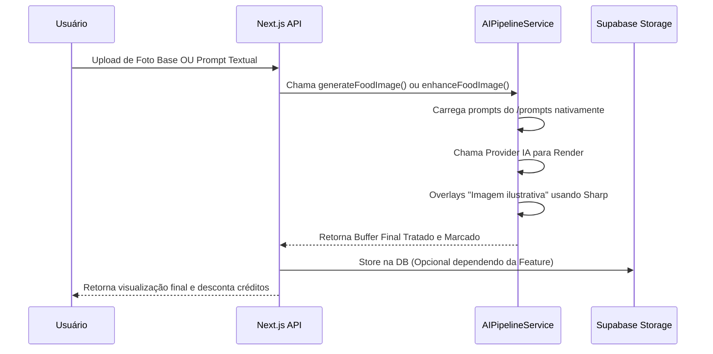

# O Pipeline de IA de Imagem

O pipeline é a espinha dorsal de todo processamento criativo da **FotoFome AI**. Construído ao redor do `src/services/AIPipelineService.ts`, o objetivo real dessa pipeline é pegar a solicitação do usuário (texto ou imagem) e transformar numa foto comercial incrível que engaje consumidores no Ifood.

## Visão Macro do Fluxo

## Sistema Dinâmico de Prompts

Os templates de instrução textual não vivem no código ou banco de dados. Eles residem no disco na pasta raiz `/prompts/`. 
Isso permite que um Prompt Engineer molde o comportamento da ferramenta apenas atualizando e committando um arquivo Markdown.
- **food-enhance.prompt.md**: Usa regras para proteger a geometria original do prato enquanto sobe drasticamente a iluminação e contraste.
- **food-generate.prompt.md**: Uma base rigorosa que exige renderização fotográfica de câmera macro de estúdio escuro quando dado apenas um texto (ex: "Pizza de Catupiry").

Ao invocar o serviço `AIPipelineService`, o Node executa a leitura desses arquivos dinamicamente através do módulo `fs`, anexando os estilos ao prompt bruto do restaurante.  

## Marca D'água Automática (Legal Compliance)

Após a recepção glorificada e tratada da Imagem pelo Provedor (ex: Midjourney ou DALL-E provider), **toda imagem** passa, incondicionalmente, por uma sanitarização visual usando a library Node `sharp`.
Uma SVG é desenhada on-the-fly (`Imagem ilustrativa`) e carimbada com extrema sutileza no canto inferior direito (`southeast`) da imagem. Isso defende o restaurante em qualquer jurisdição legal de defesa do consumidor no Brasil sem estragar o *appetite appeal* da foto.
