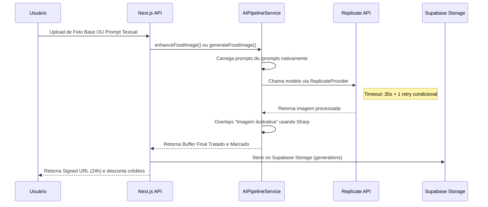

# O Pipeline de IA de Imagem

O pipeline é a espinha dorsal de todo processamento criativo da **FotoFome AI**. Construído ao redor do `src/services/AIPipelineService.ts`, o objetivo real dessa pipeline é pegar a solicitação do usuário (texto ou imagem) e transformar numa foto comercial incrível que engaje consumidores no Ifood.

## Visão Macro do Fluxo

## Modelos Atuais (Produção)

| Pipeline | Modelo | Hardware | Parâmetros |
|---|---|---|---|
| **Text-to-Image** | `black-forest-labs/flux-schnell` | — | `{ prompt }` |
| **Image-to-Image (Enhance)** | `lucataco/sdxl-controlnet` | Nvidia L40S | `{ image, prompt (SOT), negative_prompt, condition_scale: 0.9, num_inference_steps: 25 }` |
| **Menu (Multimodal)** | `yorickvp/llava-13b` | — | `{ image, prompt, max_tokens }` |
| **Menu (Fallback)** | `meta/meta-llama-3-70b-instruct` | — | `{ prompt, max_new_tokens }` |

### Estratégia de Fidelidade e Realismo (v1.4.3)
Para garantir que a comida original seja melhorada sem parecer artificial:
- **ControlNet (Canny):** Mantém 100% da composição original.
- **Condition Scale (0.9):** Calibrado para uma mesclagem natural (evita contornos artificiais).
- **Subtle Enhancement Strategy:** Foco em iluminação orgânica e texturas reais. Rejeição de cores oversaturated ou efeito HDR plástico.
- **Inference Steps (25):** Reduzido para evitar sobre-processamento visual.
- **Model Strategy:** Uso exclusivo de `stability-ai/stable-diffusion-img2img` para garantir estabilidade e compatibilidade.
- **Parameters:** `strength: 0.35`, `guidance_scale: 7`.
- **Timeout (45s):** Mantido para segurança do pipeline.

## Estratégia de Timeout (Vercel Safe)

- **Timeout por chamada:** 35s (respeitando o limite de 60s do Vercel serverless)
- **Retry:** 1 tentativa condicional apenas para erros 429 (rate limit) e 503 (service unavailable)
- **Janela total máxima:** ~55s (35s + overhead), dentro do `maxDuration: 60` da rota
- **Proteção de créditos:** Créditos só são descontados APÓS confirmação de sucesso do provider

## Sistema Dinâmico de Prompts

Os templates de instrução textual residem no disco na pasta raiz `/prompts/`:
- **food-enhance.prompt.md**: Prompt controlado para enhance — otimizado para fotografia comercial food-grade.
- **food-generate.prompt.md**: Base rigorosa para renderização fotográfica macro de estúdio escuro.

> **Nota:** O enhance pipeline utiliza um prompt interno controlado no `AIPipelineService.ts` (linha 166) focado em qualidade comercial. O `food-enhance.prompt.md` serve como referência e documentação do estilo alvo.

## Marca D'água Automática (Legal Compliance)

Após a recepção da imagem pelo Provedor, **toda imagem** passa por sanitarização visual usando a library Node `sharp`. Uma SVG é desenhada on-the-fly (`Imagem ilustrativa`) e carimbada com extrema sutileza no canto inferior direito da imagem. Isso defende o restaurante em qualquer jurisdição legal de defesa do consumidor no Brasil.
## Debug & Troubleshooting (Lifecycle Logs)

Para rastrear falhas em produção, monitore os seguintes marcadores de log no pipeline de **Enhance**:
1. `[ENHANCE_START]`: Início da orquestração.
2. `[ENHANCE_PRIMARY_SUCCESS]`: Modelo ControlNet respondeu com sucesso.
3. `[ENHANCE_PRIMARY_FAILED]`: Falha no ControlNet (ex: 404, Timeout).
4. `[REPLICATE_FALLBACK_INPUT]`: Dump do payload enviado ao modelo SDXL de contingência.
5. `[ENHANCE_FALLBACK_SUCCESS]`: Resgate bem sucedido via fallback.
6. `[ENHANCE_FALLBACK_FAILED]`: Ambos os modelos falharam.
7. `[TIMEOUT_TRIGGERED]`: O `AIPipelineService` cortou a execução por tempo excessivo (> 55s).

> **Aviso:** Se o erro for `429 Too Many Requests`, verifique o saldo de créditos no console da Replicate.
