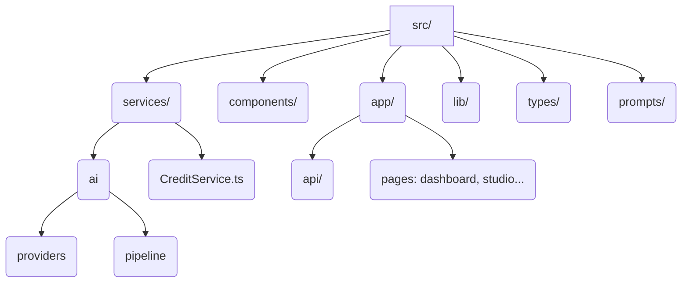

# Arquitetura do FotoFome AI

A arquitetura foi pensada para ser escalável, modular e pronta para integração com provedores de Inteligência Artificial de ponta. O objetivo é manter o frontend ultra responsivo, e o backend como um orquestrador de chamadas de API, processamento de imagem e gestão financeira (créditos).

## Visão Geral do Stack

* **Frontend:** Next.js 14, utilizando App Router (`src/app`), React Server Components e TailwindCSS para prover uma interface moderna (vibrant, dark mode e com animações).
* **Backend:** Next.js API Routes / Edge Functions (`src/app/api`).
* **Database & Auth & Storage:** Supabase. Utilizado para controlar os usuários, sessões, pacotes de créditos e servir de CDN/Storage para imagens antes e depois do processamento AI.
* **Provedores de IA Pluggable:** Design patterns que isolam a AI numa camada agnóstica (`src/services/ai/providers`), permitindo alternância entre Replicate, OpenAI (DALL-E) ou custom Stability AI no futuro.

## Estrutura de Diretórios Fonte (`src/`)

## O Pipeline Central
Todo fluxo gerador de imagem obedece o Pipeline de AI (detalhes em `docs/ai-pipeline.md`). Este fluxo é estrito: Upload → Storage → AI pipeline → Watermark → Preview.

## Rate Limiting e Segurança
A camada Edge Middleware (`src/middleware.ts`) assegura que o sistema não seja alvo de abusos e DoS, além de proteger as rotas da API limitando requests de IPs suspeitos ou limitando taxa de recarga dos créditos.
